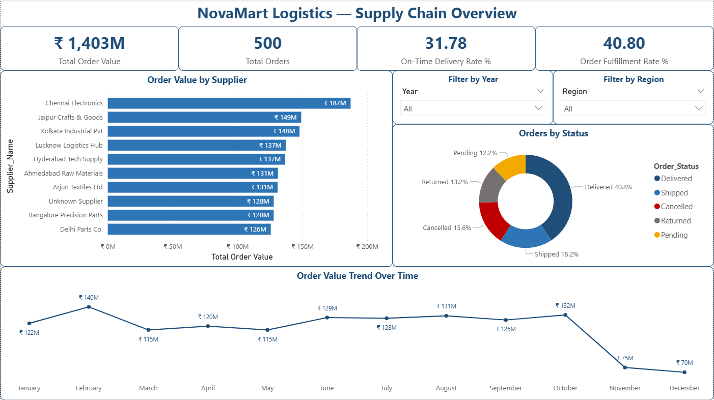
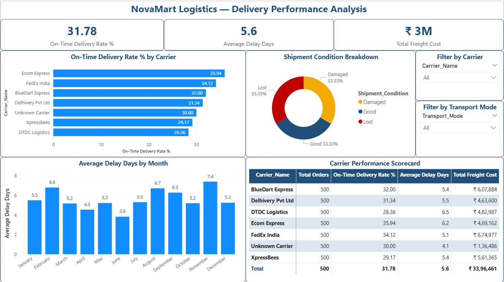
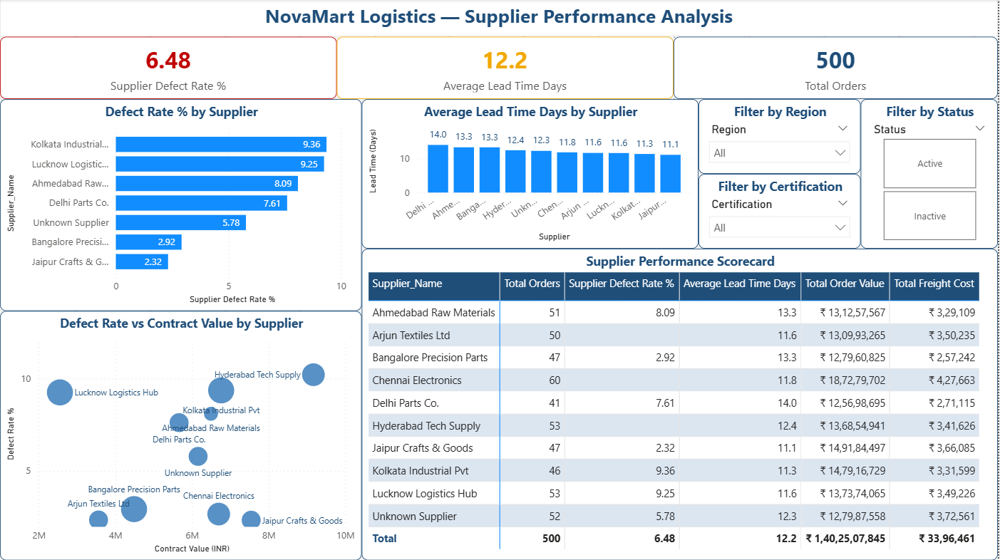
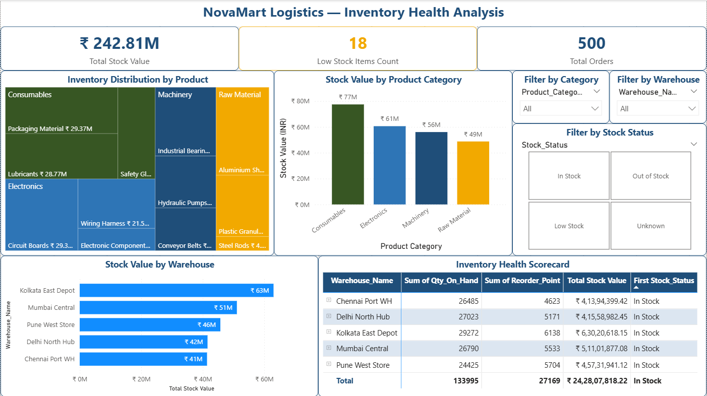

# 🚚 Supply Chain & Logistics Analytics Dashboard
### Power BI End-to-End Project | NovaMart Logistics Pvt. Ltd.

---

> **Tools Used:** Microsoft Power BI Desktop · Power Query · DAX  
> **Domain:** Supply Chain & Logistics  
> **Dataset:** Custom-built realistic dataset (Excel)  
> **Project Type:** End-to-End Analytics Dashboard  

---

## 📌 Table of Contents

1. [Problem Statement](#-problem-statement)
2. [Project Objective](#-project-objective)
3. [Data Understanding](#-data-understanding)
4. [Data Cleaning Process](#-data-cleaning-process)
5. [Data Modelling](#-data-modelling)
6. [DAX Measures](#-dax-measures)
7. [Dashboard Overview](#-dashboard-overview)
8. [Data Insights](#-data-insights)
9. [Recommendations](#-recommendations)
10. [Skills Demonstrated](#-skills-demonstrated)
11. [Files in This Repository](#-files-in-this-repository)

---

## 🔴 Problem Statement

NovaMart Logistics Pvt. Ltd. is a mid-sized manufacturing and distribution company that sources products from multiple suppliers across India, stores inventory across five regional warehouses, and ships orders to corporate customers nationwide.

The company was facing serious operational challenges:

- No centralised view of supply chain performance
- Delivery delays were frequent but not being tracked systematically
- Supplier quality and reliability were unknown across the procurement team
- Inventory shortages were being discovered too late — after orders were placed
- Procurement costs were rising with no visibility into where the money was going

Leadership needed a **single, interactive dashboard** that could give them real-time answers to these questions without manually digging through spreadsheets.

---

## 🎯 Project Objective

Build a complete, interactive **Supply Chain & Logistics Analytics Dashboard** in Power BI that enables the leadership team to:

| # | Objective |
|---|-----------|
| 1 | Monitor overall order fulfillment and business value |
| 2 | Track on-time vs delayed deliveries by carrier and month |
| 3 | Evaluate supplier reliability, defect rates, and lead times |
| 4 | Analyse inventory levels across all warehouses |
| 5 | Identify bottlenecks and flag at-risk areas proactively |

---

## 📂 Data Understanding

The dataset was built from scratch to simulate real company data. It contains **4 tables** across an Excel workbook:

### Tables Overview

| Table | Rows | Description |
|-------|------|-------------|
| `Orders` | 518 | Customer purchase orders — dates, quantities, values, status |
| `Shipments` | 462 | Delivery records — carrier, dispatch date, actual delivery, delays |
| `Suppliers` | 10 | Supplier master data — ratings, lead times, defect rates, contracts |
| `Inventory` | 60 | Warehouse stock levels — 12 products across 5 warehouses |

### Key Columns Used

**Orders:** `Order_ID`, `Customer_Name`, `Supplier_ID`, `Product_ID`, `Warehouse_ID`, `Order_Date`, `Required_Delivery_Date`, `Quantity_Ordered`, `Unit_Price_INR`, `Total_Order_Value_INR`, `Order_Status`, `Priority_Level`

**Shipments:** `Shipment_ID`, `Order_ID`, `Carrier_Name`, `Dispatch_Date`, `Expected_Delivery_Date`, `Actual_Delivery_Date`, `Transit_Days`, `Delay_Days`, `On_Time_Delivery`, `Freight_Cost_INR`, `Shipment_Condition`

**Suppliers:** `Supplier_ID`, `Supplier_Name`, `Region`, `Avg_Lead_Time_Days`, `Defect_Rate_Pct`, `Contract_Value_INR`, `Supplier_Rating`, `Status`, `Certification`

**Inventory:** `Product_ID`, `Product_Name`, `Product_Category`, `Warehouse_ID`, `Warehouse_Name`, `Qty_On_Hand`, `Reorder_Point`, `Stock_Value_INR`, `Stock_Status`

### Intentional Data Quality Issues (Real-World Simulation)

The dataset was deliberately built with common real-world data problems:

- ⚠️ **Duplicate rows** — ~18 in Orders, ~12 in Shipments
- ⚠️ **Mixed date formats** — `YYYY-MM-DD`, `DD/MM/YYYY`, `DD-MMM-YYYY`, `MM/DD/YYYY`
- ⚠️ **Inconsistent text casing** — `Active` / `active` / `ACTIVE`, `High` / `high` / `HIGH`
- ⚠️ **Blank / null values** — customer names, freight costs, carrier names, stock status
- ⚠️ **Junk column** — `_temp_flag` with no analytical value
- ⚠️ **Missing numeric values** — ~10 rows with no unit price

---

## 🧹 Data Cleaning Process

All cleaning was done inside **Power Query Editor** in Power BI before loading the data. Here is what was done on each table:

### Orders Table
- Removed 18 duplicate rows
- Deleted the junk column `_temp_flag`
- Standardised `Priority_Level` casing → Capitalize Each Word
- Standardised `Order_Status` and `Expedited_Shipping` columns
- Fixed mixed date formats on `Required_Delivery_Date`
- Replaced nulls:
  - `Customer_Name` → `Unknown Customer`
  - `Priority_Level` → `Unclassified`
  - `Payment_Method` → `Unknown`
  - `Unit_Price_INR` → `0`
- Set correct data types for all 14 columns

### Shipments Table
- Removed 12 duplicate rows
- Standardised `On_Time_Delivery` → UPPERCASE (`YES` / `NO`)
- Standardised `Shipment_Condition` → Capitalize Each Word
- Fixed mixed date formats on all 3 date columns
- Replaced nulls:
  - `Carrier_Name` → `Unknown Carrier`
  - `Freight_Cost_INR` → `0`
  - `Damage_Percentage` → `0`
- Set correct data types for all 14 columns

### Suppliers Table
- Standardised `Status` column → `Active` / `Inactive`
- Consolidated `Certification` empty strings and `None` → `Not Certified`
- Fixed mixed date formats on `Partnership_Since`
- Replaced nulls:
  - `Supplier_Name` → `Unknown Supplier`
  - `Supplier_Rating` → `0`
  - `Quality_Score_Pct` → `0`

### Inventory Table
- Standardised `Stock_Status` → Capitalize Each Word
- Fixed edge case: `Out Of Stock` → `Out of Stock`
- Replaced nulls:
  - `Stock_Status` → `Unknown`
  - `Unit_Cost_INR` → `0`
- Fixed mixed date formats on `Last_Restocked_Date`

---

## 🗂️ Data Modelling

The data model follows the **Star Schema** pattern — the industry standard for analytical reporting in Power BI.

```
              [Suppliers]
                   |
          Supplier_ID (Many→One)
                   |
[Inventory] ── [Orders] ── [Shipments]
  Product_ID ↑       ↑ Order_ID
  (Many↔Many)         (Many→One)
```

### Relationships

| From | Column | To | Type | Active |
|------|--------|----|------|--------|
| Orders | `Supplier_ID` | Suppliers | Many → One | ✅ Yes |
| Shipments | `Order_ID` | Orders | Many → One | ✅ Yes |
| Orders | `Product_ID` | Inventory | Many ↔ Many | ✅ Yes |
| Orders | `Warehouse_ID` | Inventory | Many ↔ Many | ⚪ Inactive |

> **Why inactive?** Having two active relationships between Orders and Inventory creates ambiguous filter paths in Power BI. The `Warehouse_ID` relationship is kept inactive and can be activated inside specific DAX measures using `USERELATIONSHIP()` when needed.

All DAX measures were stored in a dedicated **`_Measures`** table — an industry best practice for keeping the model organised and easy to maintain.

---

## 📐 DAX Measures

10 custom DAX measures were written inside a dedicated **`_Measures`** table to calculate all KPIs across the dashboard. Each measure was built to reflect real business logic — not just simple aggregations.

> 💡 **Why a separate `_Measures` table?**  
> Storing all measures in one place keeps the data model clean and easy to maintain. The underscore prefix `_Measures` makes it sort to the top of the fields list — a standard convention used in professional Power BI development.

---

### 🧮 Core Business Metrics

Total revenue value across all orders placed
```dax
Total Order Value = SUM(Orders[Total_Order_Value_INR])
```

Total logistics and shipping spend
```dax
Total Freight Cost = SUM(Shipments[Freight_Cost_INR])
```

Total number of orders in the system
```dax
Total Orders = COUNTROWS(Orders)
```

Total monetary value of stock held across all warehouses
```dax
Total Stock Value = SUM(Inventory[Stock_Value_INR])
```

---

### 🚚 Delivery Performance Metrics


% of shipments that arrived on or before the expected delivery date
Uses VAR variables for cleaner, more readable logic
```dax
On-Time Delivery Rate % =
VAR OnTimeCount = CALCULATE(COUNTROWS(Shipments), Shipments[On_Time_Delivery] = "YES")
VAR TotalShipments = COUNTROWS(Shipments)
RETURN DIVIDE(OnTimeCount, TotalShipments, 0) * 100
```

Average delay only for shipments that were actually late
Excludes on-time shipments (Delay_Days = 0) to avoid diluting the true delay figure
```dax
Average Delay Days =
CALCULATE(
    AVERAGE(Shipments[Delay_Days]),
    Shipments[Delay_Days] > 0
)
```

True end-to-end lead time = transit time + any delay on top
AVERAGEX iterates row by row before averaging — more accurate than a simple AVERAGE
```dax
Average Lead Time Days =
AVERAGEX(
    Shipments,
    Shipments[Transit_Days] + Shipments[Delay_Days]
)
```

---

### 📦 Order & Inventory Metrics

% of total orders that were successfully delivered to the customer
Uses VAR pattern for readability and easier debugging
```dax
Order Fulfillment Rate % =
VAR DeliveredOrders = CALCULATE(COUNTROWS(Orders), Orders[Order_Status] = "Delivered")
VAR TotalOrders = COUNTROWS(Orders)
RETURN DIVIDE(DeliveredOrders, TotalOrders, 0) * 100
```

Count of product-warehouse combinations currently flagged as Low Stock
Useful for triggering reorder alerts
```dax
Low Stock Items Count =
CALCULATE(
    COUNTROWS(Inventory),
    Inventory[Stock_Status] = "Low Stock"
)
```

---

### 🏭 Supplier Metrics

Average defect rate across active suppliers only
Inactive suppliers are excluded to prevent historical data from skewing current performance
```dax
Supplier Defect Rate % =
CALCULATE(
    AVERAGE(Suppliers[Defect_Rate_Pct]),
    Suppliers[Status] = "Active"
)
```

---

### 📊 Measures Summary Table

| Measure | Formula Used | Business Purpose |
|---------|-------------|-----------------|
| Total Order Value | `SUM` | Total revenue value of all orders |
| Total Freight Cost | `SUM` | Total logistics spend |
| Total Orders | `COUNTROWS` | Volume of orders placed |
| Total Stock Value | `SUM` | Total warehouse inventory value |
| On-Time Delivery Rate % | `CALCULATE` + `DIVIDE` + `VAR` | Delivery reliability score |
| Average Delay Days | `CALCULATE` + `AVERAGE` | Severity of delays (delayed orders only) |
| Average Lead Time Days | `AVERAGEX` | True end-to-end fulfillment time |
| Order Fulfillment Rate % | `CALCULATE` + `DIVIDE` + `VAR` | % of orders successfully delivered |
| Low Stock Items Count | `CALCULATE` + `COUNTROWS` | Inventory alert indicator |
| Supplier Defect Rate % | `CALCULATE` + `AVERAGE` | Active supplier quality metric |

---

## 📊 Dashboard Overview

The dashboard is split across **4 report pages**, each targeting a different stakeholder:

---

### Page 1 — Executive Overview
> *For: Senior Management & C-Suite*

Provides a full business summary at a glance.

- **KPI Cards:** Total Order Value · Total Orders · On-Time Delivery Rate % · Order Fulfillment Rate %
- **Bar Chart:** Order Value by Supplier
- **Donut Chart:** Orders by Status (Delivered / Shipped / Pending / Cancelled / Returned)
- **Line Chart:** Order Value Trend Over Time (monthly)
- **Slicers:** Filter by Year · Filter by Region



---

### Page 2 — Delivery Performance
> *For: Operations & Logistics Teams*

Answers: are deliveries arriving on time, which carriers are failing, and which months are worst?

- **KPI Cards:** On-Time Delivery Rate % · Average Delay Days · Total Freight Cost
- **Bar Chart:** On-Time Rate by Carrier — conditional red/blue coloring below 70%
- **Column Chart:** Average Delay Days by Month — red columns flag months above 5 days
- **Donut Chart:** Shipment Condition (Good / Damaged / Lost)
- **Matrix Table:** Full Carrier Performance Scorecard
- **Slicers:** Filter by Carrier · Filter by Transport Mode



---

### Page 3 — Supplier Analysis
> *For: Procurement Teams*

Evaluates supplier quality, lead times, and contract value to support procurement decisions.

- **KPI Cards:** Supplier Defect Rate % · Average Lead Time Days · Total Orders
- **Bar Chart:** Defect Rate by Supplier — traffic light coloring (green/amber/red)
- **Column Chart:** Average Lead Time by Supplier
- **Scatter Plot:** Defect Rate vs Contract Value — quadrant analysis
- **Matrix Table:** Full Supplier Performance Scorecard
- **Slicers:** Filter by Region · Filter by Status · Filter by Certification



---

### Page 4 — Inventory Health
> *For: Warehouse & Operations Managers*

Monitors stock levels, identifies low-stock risks, and shows inventory distribution.

- **KPI Cards:** Total Stock Value · Low Stock Items · Total Orders
- **Bar Chart:** Stock Value by Warehouse — conditional coloring by threshold
- **Column Chart:** Stock Value by Product Category
- **Treemap:** Inventory Distribution by Product (two-level: category → product)
- **Matrix Table:** Inventory Health Scorecard — drill-down by warehouse and product
- **Slicers:** Filter by Warehouse · Filter by Category · Filter by Stock Status



---

## 💡 Data Insights

After building the dashboard and exploring the data, here are the key findings:

### Delivery Performance
- Overall **On-Time Delivery Rate is approximately 70%** — meaning nearly 1 in 3 shipments is delayed, which is a significant operational risk
- Certain carriers consistently show on-time rates **below 60%**, indicating a need for contract review
- Specific months show average delay spikes above 5 days, suggesting seasonal or capacity-related patterns

### Supplier Performance
- Defect rates vary significantly across suppliers — some active suppliers show defect rates **above 8%**, which is well above an acceptable threshold for manufacturing inputs
- A few high-value suppliers (large contract amounts) also have high defect rates — visible clearly in the Scatter Plot quadrant analysis
- Average lead times range from as low as 3 days to over 18 days across different suppliers, making supply planning inconsistent

### Order Fulfillment
- Order Fulfillment Rate sits below 90% across the dataset, meaning a meaningful share of orders are not being fully delivered as promised
- A notable number of orders are in **Pending or Cancelled** status, pointing to upstream supply or inventory issues

### Inventory Health
- Several product-warehouse combinations are at **Low Stock or Out of Stock** levels
- Stock value is unevenly distributed across warehouses — some locations are significantly under-stocked compared to others
- Machinery and Electronics categories hold the highest stock value, making them the most critical to monitor for stockouts

---

## ✅ Recommendations

Based on the insights from the dashboard:

1. **Review underperforming carrier contracts** — carriers with on-time delivery below 60% should be escalated for performance review or replaced with better alternatives

2. **Prioritise supplier quality audits** — suppliers in the top-right quadrant of the Scatter Plot (high contract value + high defect rate) represent the highest business risk and should be audited immediately

3. **Standardise lead times in supplier contracts** — the large variance in lead times makes it impossible to plan inventory effectively; SLA-bound lead time clauses should be introduced

4. **Set up reorder alerts for low-stock items** — the dashboard flags low-stock combinations but the business needs a process to act on these alerts before stockouts occur

5. **Investigate high-delay months** — months with average delays above 5 days need root cause analysis (capacity constraints, seasonal demand spikes, specific carrier or route failures)

6. **Redistribute inventory across warehouses** — some warehouses are significantly over or under-stocked; a rebalancing strategy would improve fulfillment rates without increasing total inventory cost

7. **Reduce order cancellations** — cancelled and pending orders are costing revenue and customer trust; tracing these back to supplier or inventory root causes should be a priority

---

## 🛠️ Skills Demonstrated

| Area | Details |
|------|---------|
| **Power Query** | Data cleaning, type conversion, null handling, deduplication, format standardisation |
| **Data Modelling** | Star schema, relationships, cardinality, active vs inactive relationships |
| **DAX** | SUM, COUNTROWS, DIVIDE, CALCULATE, FILTER, AVERAGEX, VAR variables |
| **Visualisations** | Card, Bar Chart, Column Chart, Line Chart, Donut Chart, Scatter Plot, Treemap, Matrix |
| **Interactivity** | Slicers, cross-filtering, page navigation buttons, conditional formatting |
| **Dashboard Design** | Multi-page layout, colour theming, alignment, typography, storytelling |

---

## 📁 Files in This Repository

```
📦 supply-chain-powerbi-dashboard/
 ┣ 📊 NovaMart_SupplyChain_Dashboard.pbix
 ┣ 📂 NovaMart_SupplyChain_Dataset.xlsx
 ┣ 📄 README.md
 ┗ 📁 images/
    ┣ 🖼️ executive-overview.png
    ┣ 🖼️ delivery-performance.png
    ┣ 🖼️ supplier-analysis.png
    ┗ 🖼️ inventory-health.png
```

---

## 🙋 About This Project

This project was built as part of a structured, end-to-end Power BI learning programme. The goal was to go through the complete analytics workflow — from raw messy data all the way to a polished, interactive dashboard — the same way it would be done in a real industry setting.

Every step was intentional: the dataset was designed with real data quality issues, the model follows professional standards, and the dashboard is structured around actual business questions that operations and procurement teams care about.

---

*If you found this project helpful or have any feedback, feel free to connect!*
